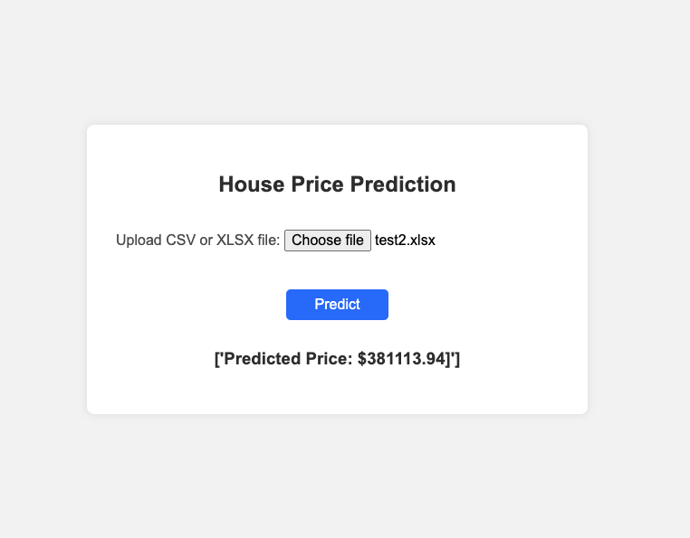

# House Price Prediction Project

## Overview
This repository contains the House Price Prediction project, developed as part of the MIUUL Data Science Program. The project aims to predict hourly prices using data science techniques and is showcased through a web interface built with Flask.

## Project Structure
- `notebook/`: This directory contains the Jupyter notebook where the data analysis and model training are performed.
- `web/`: This directory holds the Flask application that serves the prediction model through a web interface.
- `images/`: Contains images related to the project, including screenshots of the web interface.

## Web Interface

The web interface provides a user-friendly way to interact with the prediction model. Users can input data, and the model will output the predicted price for the specified hour.

## Installation and Setup
To set up this project on your local machine, follow these steps:

1. Clone the repository:
git clone https://github.com/abdurrahmanbulut/miuul-data-science-course.git

2. Navigate to the project notebook directory:
cd miuul-data-science-course
cd final-project
cd notebook

3. Install the required Python packages
4. Run the Jupyter notebook to train the model and explore the data

To run web part of this project on your local machine, follow these steps:
1. Clone the repository:
git clone https://github.com/abdurrahmanbulut/miuul-data-science-course.git

2. Navigate to the project notebook directory:
cd miuul-data-science-course
cd final-project
cd web

3. Install the required Python packages
4. Start the Flask application:
python app.py

## Usage
Once the Flask app is running, navigate to `http://localhost:5000` in your web browser to use the web interface.

## Contributing
Contributions to this project are welcome. Please fork the repository, make your changes, and submit a pull request.

## License
This project is licensed under the MIT License

## Acknowledgments
- Thanks to the MIUUL Data Science Program for guidance and resources.
- All contributors who have helped with this project.
